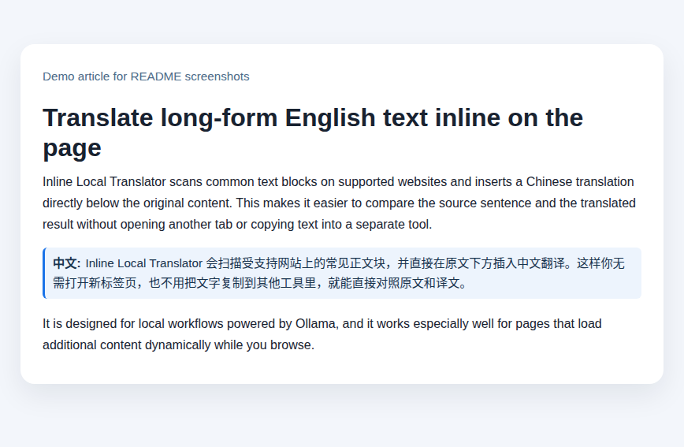
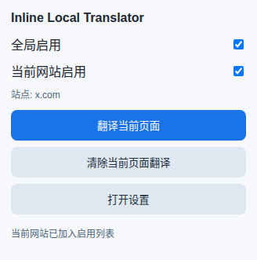
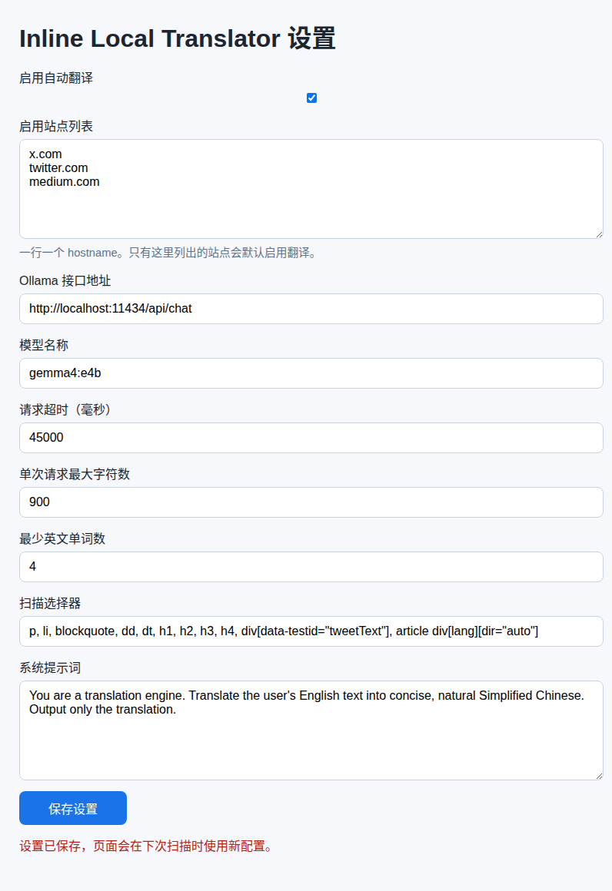

# Inline Local Translator

一个可直接加载到 Edge 的网页翻译插件，支持本地 `Ollama` 和 `Microsoft Foundry`。

仓库地址：`https://github.com/1openwindow/inline-local-translator`

## Screenshots

### Inline translation



### Popup



### Settings



功能：

- 浏览网页时自动扫描常见英文正文块
- 在原文下方直接插入中文翻译
- 支持通过本地 `Ollama` 或 `Microsoft Foundry` 请求模型
- 支持动态页面内容继续翻译
- 长段落会自动分块翻译，减少漏翻
- 页面右上角显示实时翻译状态
- 支持 X/Twitter 的 tweet 正文结构
- 支持全局开关、启用站点白名单、当前站点开关、模型和接口配置

## 默认配置

- Provider：`Ollama`
- Ollama 地址：`http://localhost:11434/api/chat`
- Ollama 模型：`gemma4:e4b`

macOS 使用本地 Ollama 时，需要允许扩展页面访问 Ollama API。执行：

```bash
launchctl setenv OLLAMA_ORIGINS "http://localhost:3000,http://127.0.0.1:3000,chrome-extension://*,extension://*"
```

如果 Ollama 已经在运行，执行后重启 Ollama 让配置生效。

## 安装方式

### 方式一：从 Releases 下载 zip

1. 打开仓库 Releases 页面
2. 下载最新的 `inline-local-translator-<version>.zip`
3. 解压到本地目录
4. 打开 Edge，进入 `edge://extensions`
5. 打开“开发人员模式”
6. 选择“加载解压缩的扩展”
7. 选择解压后的目录

### 方式二：直接加载仓库目录

1. 打开 Edge，进入 `edge://extensions`
2. 打开“开发人员模式”
3. 选择“加载解压缩的扩展”
4. 选择本目录：`~/repos/inline-local-translator`

## 使用方式

1. 确保已配置可用的 `Ollama` 或 `Microsoft Foundry` 模型
2. 打开任意英文网页
3. 插件会自动在检测到的英文段落后插入中文翻译
4. 点击插件图标可以：
   - 开关全局翻译
   - 把当前网站加入或移出启用列表
   - 手动触发当前页翻译
   - 清除当前页已插入翻译
5. 在设置页中可以修改 provider、模型、接口地址、提示词和扫描规则

## Microsoft Foundry 配置

在设置页把 `模型提供方` 切换为 `Microsoft Foundry` 后，填写：

- `AZURE_API_BASE`：例如 `https://<your-resource>.services.ai.azure.com/openai/v1`
- `AZURE_API_KEY`：你的 Foundry API key
- `MODEL_NAME`：例如 `gpt-5-mini`

说明：

- 扩展会向 `${AZURE_API_BASE}/chat/completions` 发送 OpenAI 兼容请求
- `AZURE_API_KEY` 只保存在当前浏览器本机，不写入同步存储
- `最大并发请求数` 控制同一页面同时进行的翻译请求数量，默认是 `2`
- 设置页的 `测试连接` 会用当前表单值发送一条 `Hello world` 测试请求，不需要先保存

## 说明

- 当前版本主要翻译段落级内容，不强行处理每一个行内短语，这样能明显降低误翻和页面布局破坏。
- `单次请求最大字符数` 控制每次发给模型接口的文本块大小。长段落会自动拆分后分别翻译，再拼接显示。
- 翻译结果会缓存在浏览器本地。同一模型、接口和提示词下，相同英文文本在页面刷新或跳转后会复用缓存，减少重复请求。
- X/Twitter 会额外扫描 `div[data-testid="tweetText"]` 和 `article div[lang][dir="auto"]`，以兼容运行时 React DOM。
- 只有在 `启用站点列表` 中列出的 hostname 会自动启用翻译。
- 如果某些网站正文结构特殊，可以在设置页调整 `扫描选择器`。
